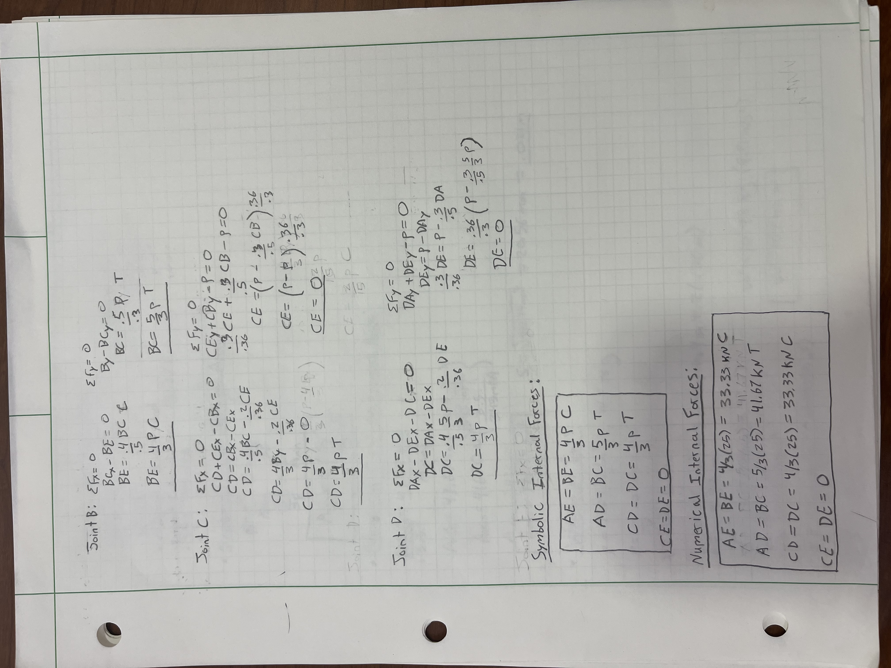
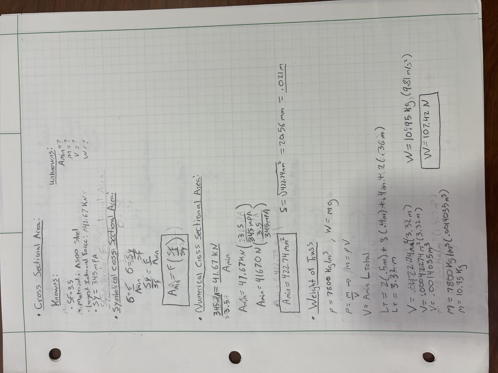
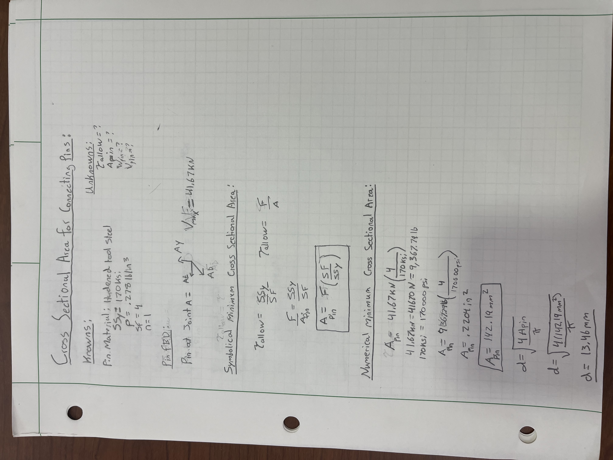
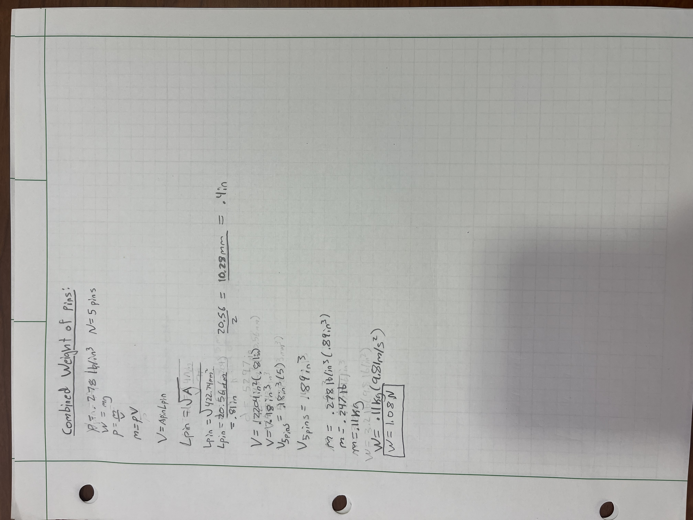
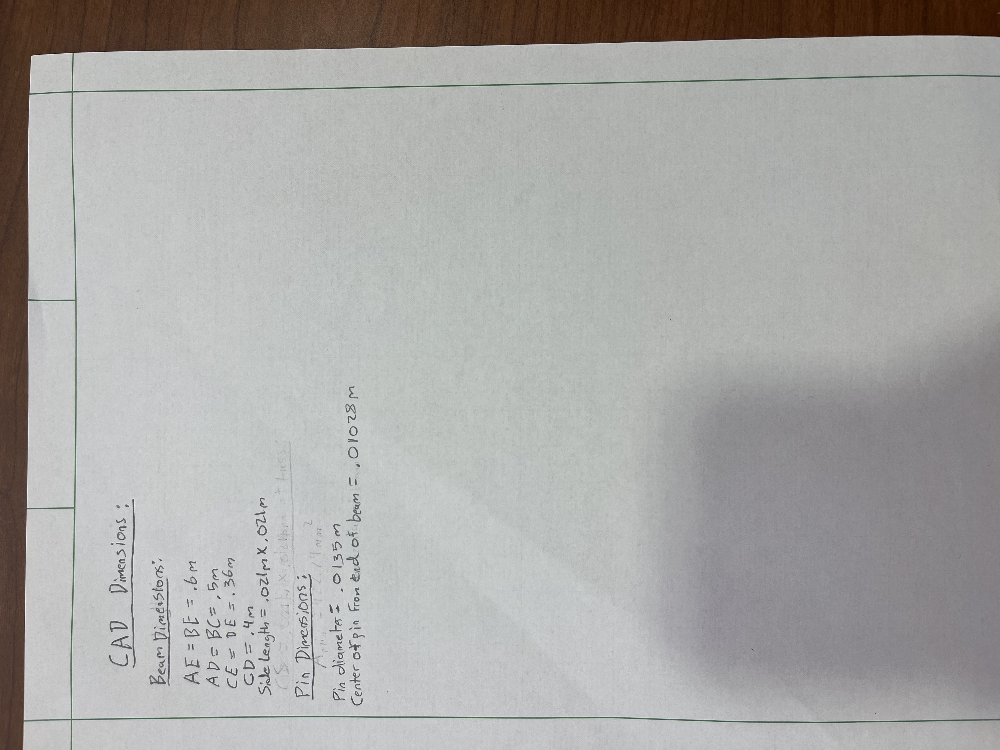
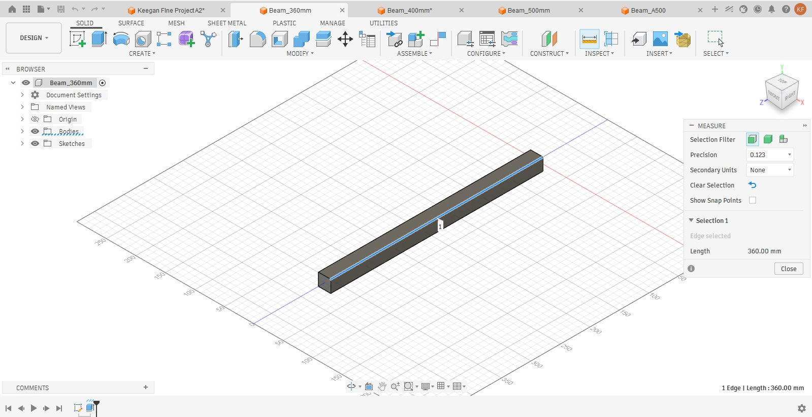
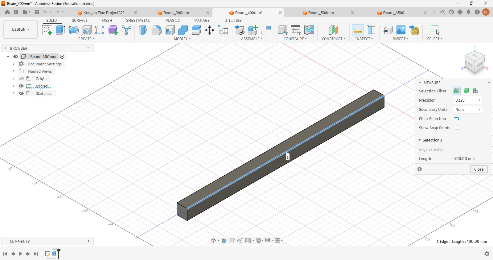
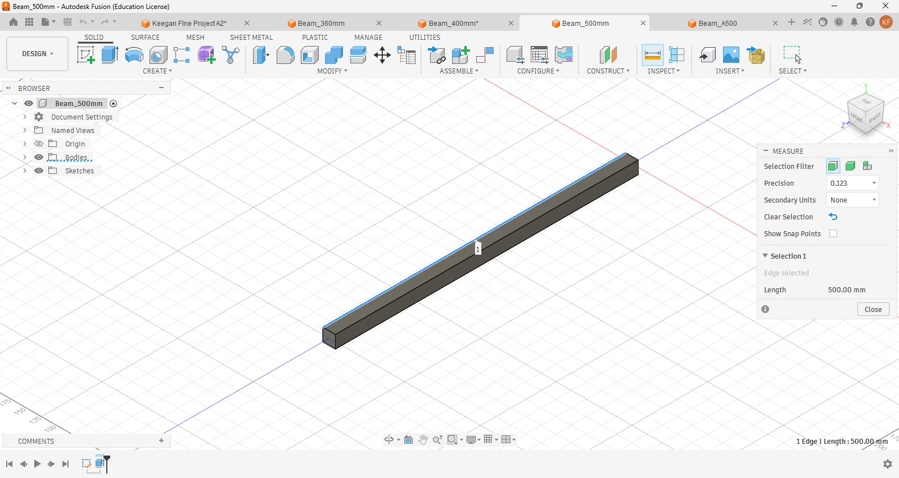

# A2 – Design with Basic Stress
## Objective
- Design a lightweight planar truss using A500 steel or an alternative material.
- Create free body diagrams (FBDs) for joints and critical pins.
- Calculate the required cross-sectional area of truss elements with a safety factor.
- Determine pin sizes based on shear forces with a safety factor.
- Solve equations symbolically and numerically for both truss and pin design.
- Estimate the total weight of the truss and pins.
- Create a CAD model with accurate dimensions and connections.
- Compare CAD weight predictions with hand calculations.
- Document key engineering lessons learned from the process.

- Design Constraints

  

## Design Process

# Truss Geometry 
I chose a half hexagonal shape because it creates an efficient and symmetrical load path that minimizes unnecessary material while maintaining structural stability. To do this I added Joint E halfway between AB. By doing this it created space for two more beams CE and DE, these two inner members act as zero-force members under pure static loading; while they do not carry primary stress, their presence is crucial because they shorten the unbraced length of the top chord, preventing local buckling and maintaining symmetry across the entire frame. Throughout the design process and calculations, I stuck with SI units to keep things as simple as possible. 

 # Internal Forces 
 After the truss design was laid out, I symbolically solved for the external forces using basic static equilibrium and moments equations starting at Joint A. With external reactions known, the Method of Joints was applied starting at Joint B and moving through Joints A, C, and D. At each node, horizontal and vertical force equilibrium equations were used to symbolically solve for the internal forces and determine whether they were under tension or compression. this allowed for simple plug and play equations to solve for the numerical values of the internal forces. 

 
# Truss Cross-Sectional Area and Weight
Once the peak internal force was identified, the required material cross-sectional area was determined using allowable stress design principles. The allowable stress was calculated by dividing the material yield strength of A500 steel by the required safety factor of 3.5. Setting the maximum force over the unknown minimum area equal to this allowable stress yielded the symbolic and numerical cross-sectional area required to prevent yielding. Using a solid square profile, taking the square root of this area defined the required side dimension for CAD modeling. Finally, the total volume of the truss was calculated by multiplying this cross-sectional area by the summed lengths of all individual members, which was then multiplied by the steel density and gravitational acceleration to derive the total structural mass and weight.

 # Connecting Pin Cross-Sectional Area and Weight
To determine the cross-sectional area for the pins I needed to first determine the joint with the maximum shear stress. A free-body diagram of pin A was analyzed assuming single shear loading conditions. The allowable shear stress was calculated by taking the tool steel's yield shear strength and dividing it by a safety factor of 4.0. Dividing the maximum shear force by this allowable shear stress produced the minimum cross-sectional pin area, which was then used to calculate the required pin diameter. To estimate total pin weight, the volume of a single pin was calculated based on its cross-sectional area and length, multiplied by the total number of joint pins in the truss N=5, and scaled by the tool steel material density and gravity.

# Cad Design 

Before Implementing my designs into CAD software, I organized all my dimensions into a list, this allowed for an efficient and organized design process. For this design Autodesk Fusion was used because I had not used it prior and it great reviews and a lot of design tools implemented into the software to expediate and maximize the efficiency of the design process. Using A500 steel I designed all my beams first and then using tool steel I designed the pins. for the assembly I opted for a different approach instead of manually assembling the entire truss. I used the Autodesk Fusion assistant to help place the pins correctly, as well as analyzing the truss to find ways to improve the structure and stability. This analysis determined that the AE and BE beams could be merged into one AB beam with 2 pins at each end and 1 pin in the middle of the beam. 

## Decide
_Which geometry did you select, and why? This is your first open design choice in the course — defend it._

## lessons Learned 

