# A3 – [Parametric and FEA]

## Objective
- Use axial deflection modeling to design its dimensions
- Use parametric design to determine a bars length
- Introduce you to FEA (Finite Element Analysis)
- Introduce you to linking dimensions to appropriate parameters in CAD.
- Compare and contrast the different analysis
 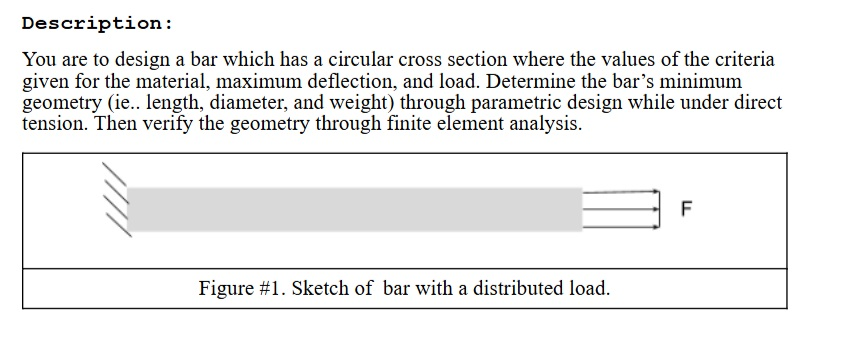

## Design Process

### Design Drawing / Calculations
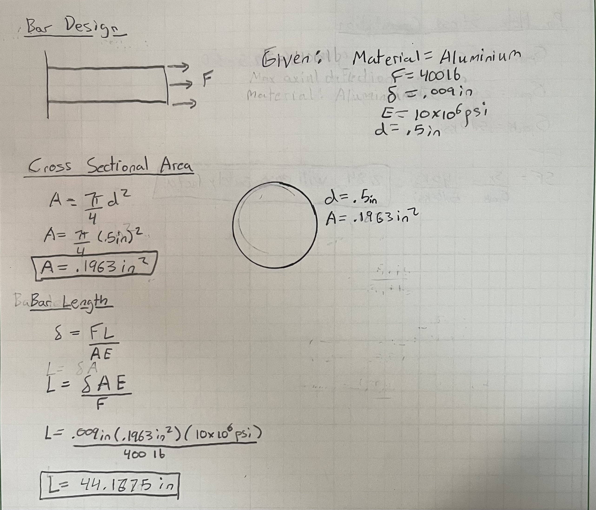
Given the beam description and the provided values, I was tasked to construct an aluminium beam with a circular cross section and find the optimal length that could satisfy a max axial deflection of .009in and withstand a tensile load of 400lb. to do this I chose a diameter of .5in and solved for the cross-sectional area. After finding the cross-sectional area, I was able to derive the beam length from the direct tension elongation equation. 

### CAD Design 
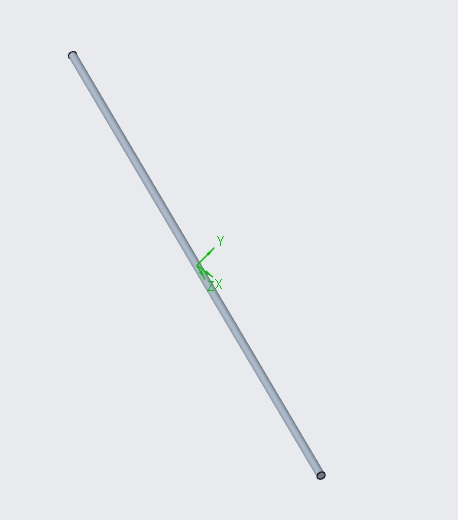

To design a beam with specific parameters and an Aluminum material I used Creo because it had more freedom in terms of what parameters could be set and how they were utilized. 
**- Step 1 (Parameters):** Before creating a sketch, I opened the parameters settings underneath the modify bar in Creo and entered in the given values for force, axial deflection, elasticity for aluminum, and the diameter for the bar. In order to check my hand calculations, the cross-sectional Area equation and Length equation was plugged into the relations box. this worked similar to an excel sheet by allowing the user parameters to work directly with these equations.

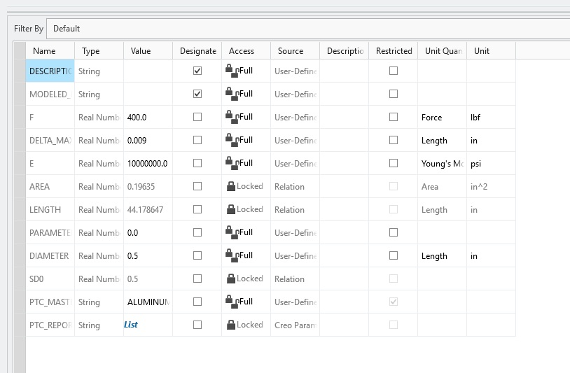

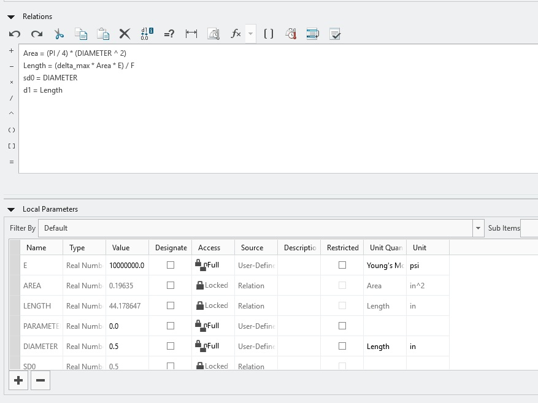

**- Step 2 (Sketch & Extrude):** Now that the parameters were set, I drew a simple circular sketch and directly applied the user parameters by labeling my dimension as d0. From here the circle was extruded into a cylindrical beam and given a length of d1 which equaled the length equation that was previously put into the relations box. In Creo for a design to contain a material it must first be a 3D model, in order to this I went into the modify materials settings under file>prepare and changed it to Aluminum.

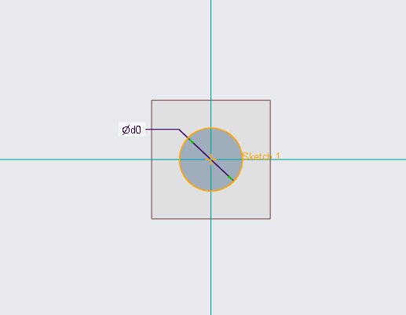

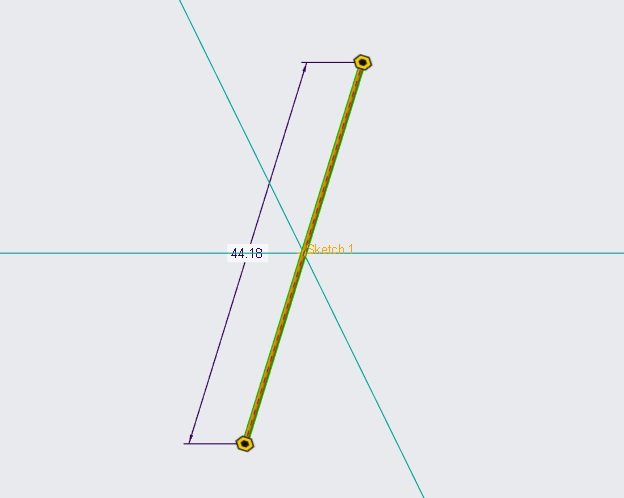

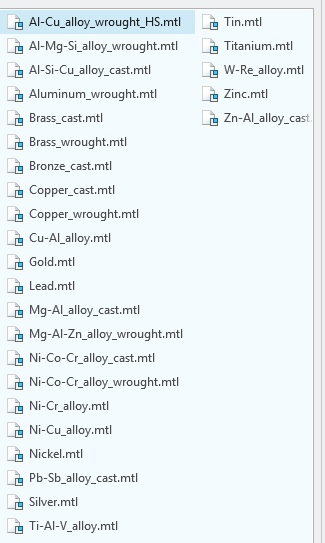

**- Step 3 (FEA):** In order to run an FEA on this design I switched Creo into simulate mode and applied a fixed constraint at the left end of the bar and a pulling force at the right end of the bar. The pulling force on the right side of the bar was labeled "F" and directly translated to the force parameter that had been set. After setting up the bar constraints, I ran the analysis and created an axial deflection map and a von Mises Stress Map. Below are the results of both of these Analysis's, the top is the axial deflection map, and the bottom is the von Mises Stress Map. 

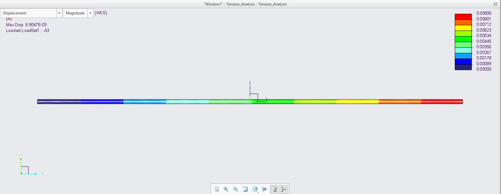

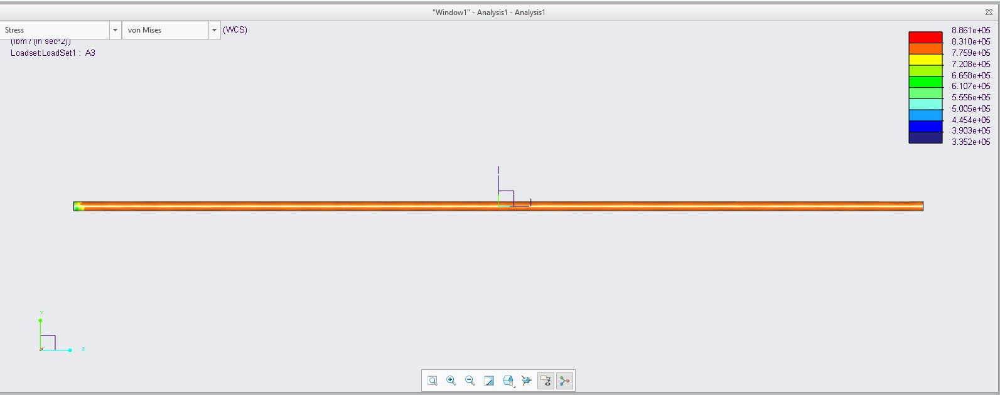

### Design Reflection
After running the FEA and calculating the maximum stress, it was concluded that the maximum stress was 2.037ksi which is significantly lower than the 40ksi yield strength of aluminum. the creo calculation for this was 2.295ksi which is slightly more than my calculation due in part to the fixed edge constraint effects at the left side of the bar. Using these values, I calculated a safety factor of 17.43. The percent difference in axial deflection came out to be a 1.06% difference. these values are essentially the same however, this small deviation could have occurred because the slight stiffness near the fixed face constraint in the Creo FEA vs my original hand drawn design which assumes ideal uniform strain across the entire length of the bar.  

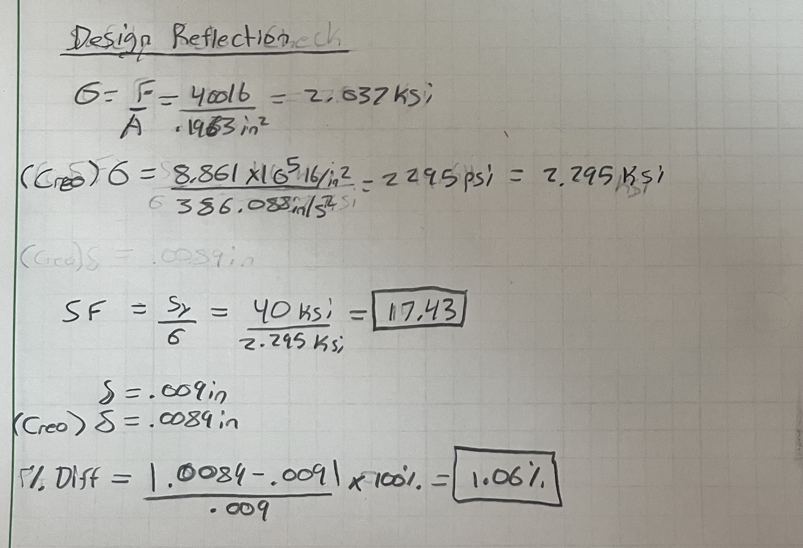

**- Pin Hole Concentration:** According to Peterson's Stress Concentration Factors, a standard transverse hole in a tension bar yields a theoretical stress concentration factor of Kt = 2.5. Using this value, I calculated the nominal stress and then the peak stress which came out to be 5.10ksi. the peak stress remains far below the 40ksi yield strength of Aluminum, maintaining a safety factor of 7.8. this means it would easily pass the safety factor. 

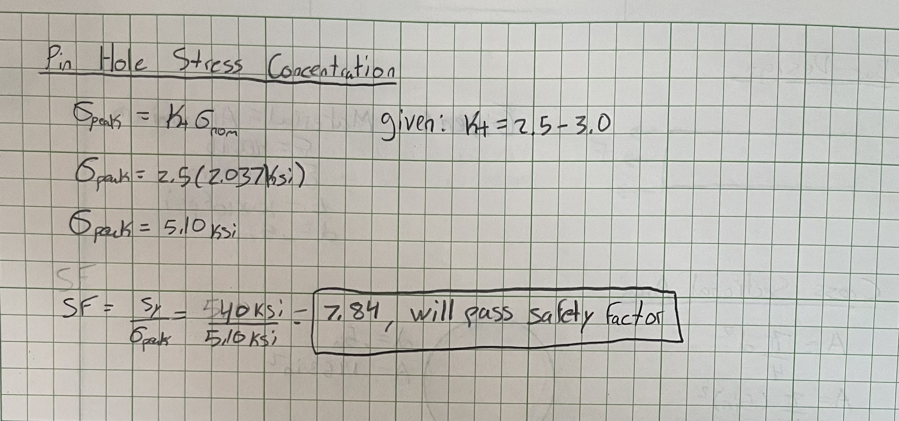

## Lessons Learned

Previous to this project I did not have any experience running FEA on a CAD model which made it a learning curve. I was unsuccessful implementing parameters and equations for those parameters into Fusion; this led me to switch to Creo where I learned how to successfully implement parameters and apply them directly to my design. The only issue with Creo was a technical difficulty with my computer screen size which wouldn't allow me to proceed on the FEA analysis. I solved this by using keyboard shortcuts once I had input the analysis settings. The only confusion I had with this project however was the description for the bar uses a circular cross-sectional area however the outline portion treats the cross-sectional area like a rectangle when it asks to use width height and thickness. I stuck with my original circular design and yielded great results. This project took me about 5-6 hours over the course of two afternoons. 

### CAD File
[Download Bar(.prt)](./a3.prt.3)

