# A4 – [Motor Mount]

## Objective
Design a motor mount using the (Brushed 24V DC Gear Motor 3.6Kg.cm/46RPM w/ 99.5:1 Planetary Gearbox) which attaches to the rigid wall A. For both features, first design for yield strength and then design for a maximum deflection of .30 mm at the free end. You may select ABS, PETG,  or PLA as a motor mount material.  When designing the motor mount take into account a safety factor of 3 and neglect the weight of the motor. For steps 1 and 2 draw a FBD of the forces and a concept of your design. Research the design of different motor mounts and place the links in an appendix on your page. Make justifiable approximations in your design to simplify your analysis. (ie. use the beam calculations) Follow Appendix B for the initial approach to set up the design analysis.
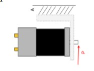
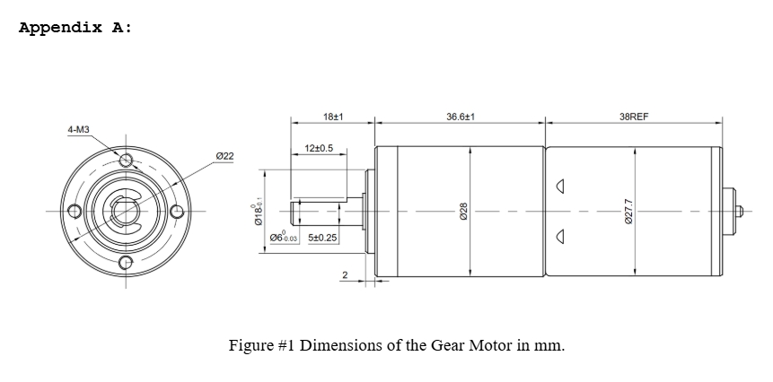
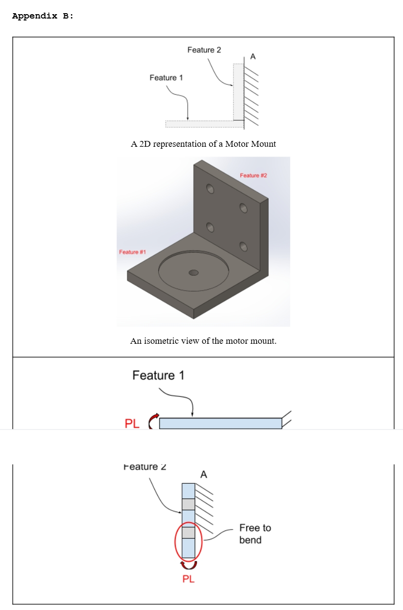

## Design Process

### Hand Drawn Design / Calculations
In order to design a motor mount for the Brushed 24V DC Gear Motor the first step was to research some different types of motor mounts. Since this motor is relatively small and simple I decided to go with a basic design similar to the one in Appendix B. This allowed me to use an additive manufactured material called PETG. The reason I chose this over ABS or PLA was because it met all the necessary requirements without sacrificing any. PETG was the strongest out of the three and although it did not have the highest tolerance to temperature as ABS, it is not going to be used for a high heat application. The next step in the process was to create FBD's for section 1 and section 2 of the mount. After drawing the FBD's and solving equilibrium moment and force equations I began to solve symbolically and numerically for the appropriate thickness that could withstand an elongation of .3mm without failing. Once these values were determined I draw the Isometric views for each section with their respective dimensions. 

### CAD Design 
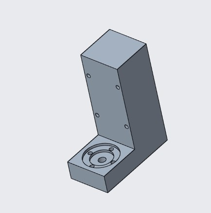

To design a functional motor mount, I chose Creo due to my familiarity with the software and its ability to create technical precise parts and drawings. Creo also allows you to create a material if it does not provide the one you need.  

**- Step 1 (Material/Units):** Before creating my first sketch I opened the prepare part tab in the file tab and changed the units to mm and the material to PETG. Unfortunately, Creo does not have PETG as an option, but it does allow you to create a new material in the change materials folder. In order to do this, you have to manually input the materials properties such as Mass density, yield strength, Poisson's Ratio, and modulus of elasticity. 

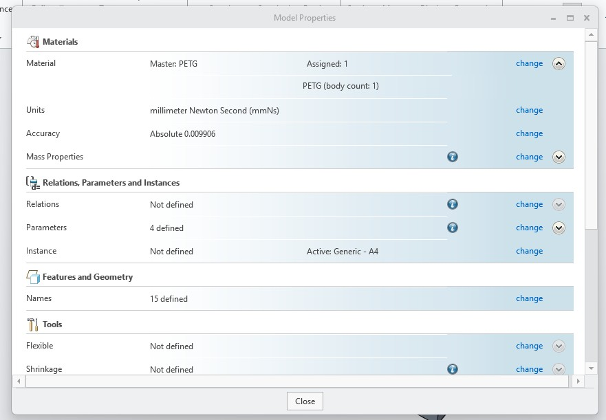

**- Step 2 (Sketch & Extrude):** Instead of creating section 1 and 2 as two different parts I designed them as one whole piece. Doing this would allow for a stronger motor mount and a simpler manufacturing process. I started with section 1 first and after sketching and extruding that I sketched and extruded the top face for the bolt holes and motor fittings. The circular fittings for the motor each have a +.05 tolerance allowing for a snug fit. Once this was done, I sketched section 2 on the backside of section 1 and extruded. once extruded I placed the bolt holes in section 2 by dividing the original 75mm length by 4 which gave me 4 sections each 18.15mm long. This allowed me to place 2 bolt holes 18.15mm from the top and 2 more 18.15 from the bottom of the original 75mm dimension. 

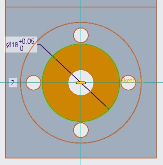

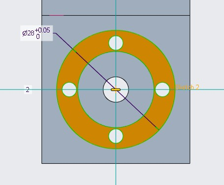

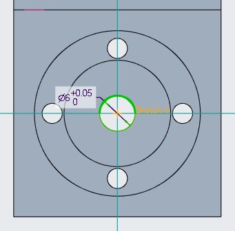

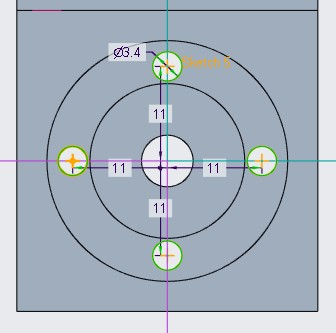

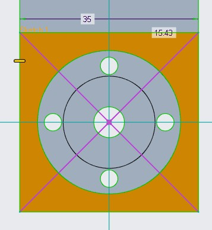

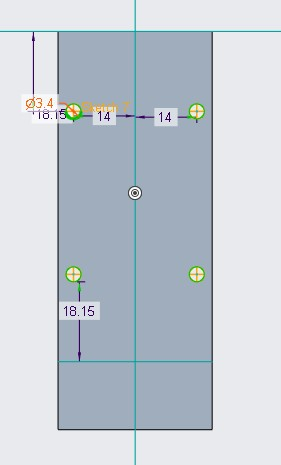

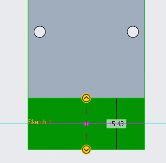

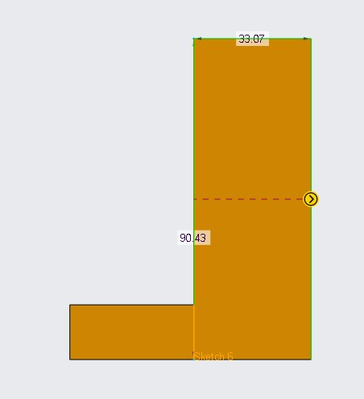

**- Step 2 (CAD Drawing):** Once the part was complete, I created a drawing in Creo and directly transferred my part file. The drawing I have created shows the 3D orthogonal view, top view, right view, and the front view. within these views I allowed for hidden lines which show the bolt holes going through the entire part. Since I had previous experience using Creo I had already installed the UNCC drawing format which provided a template to list design specifications, manufacturing process, etc.   

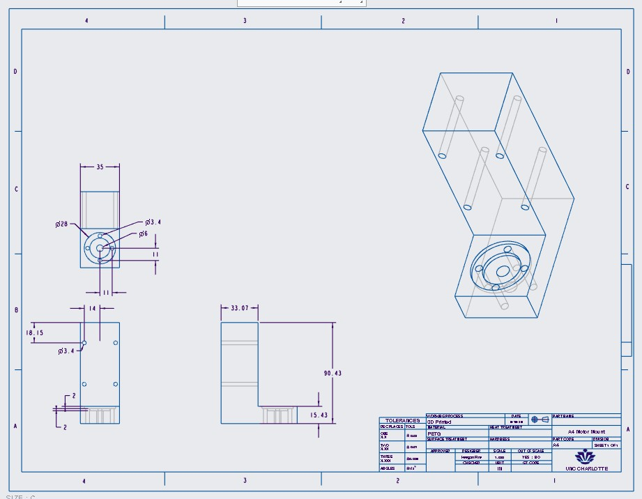

## Lessons Learned
Although I was pretty comfortable designing the motor mount and calculating the correct dimensions, I did not utilize my time as well as I should have. This lack of time management forced me to leave out some major details due to running out of time. I was unable to fix the tolerance display issues in my Creo drawing even after altering the file configurations, I left out key dimensions for the holes that specify how far to drill them and how to drill them, and i was unable to upload external links that provided insight on motor mount design. 

## CAD Files
[Download Bar(.prt)](./a4.prt.6)
[Download Bar(.drw)](.drwa4.drw.1)

