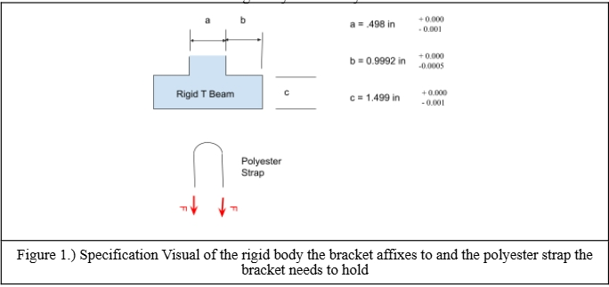
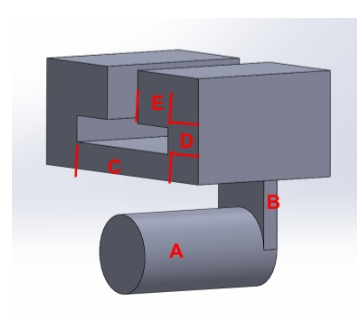
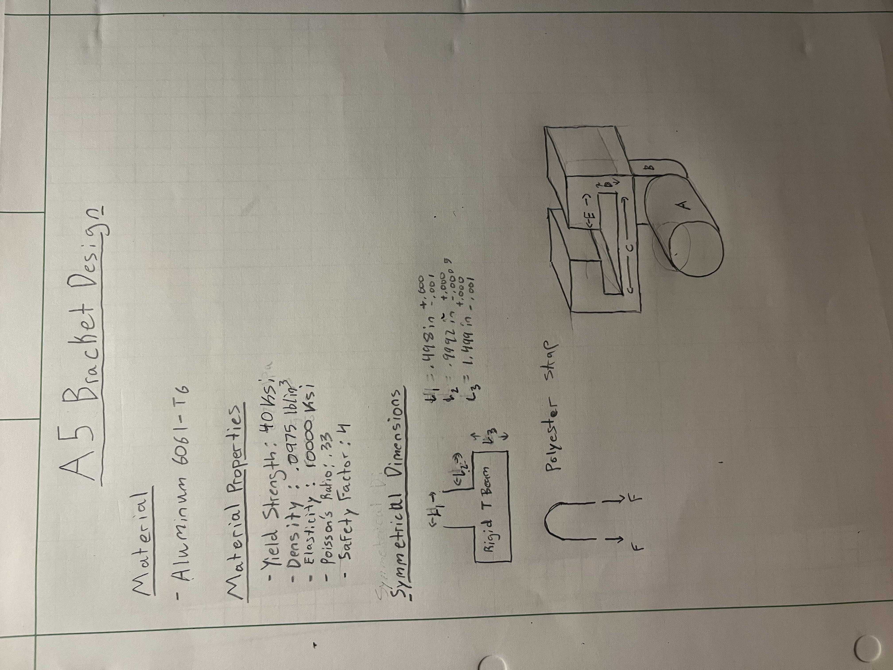
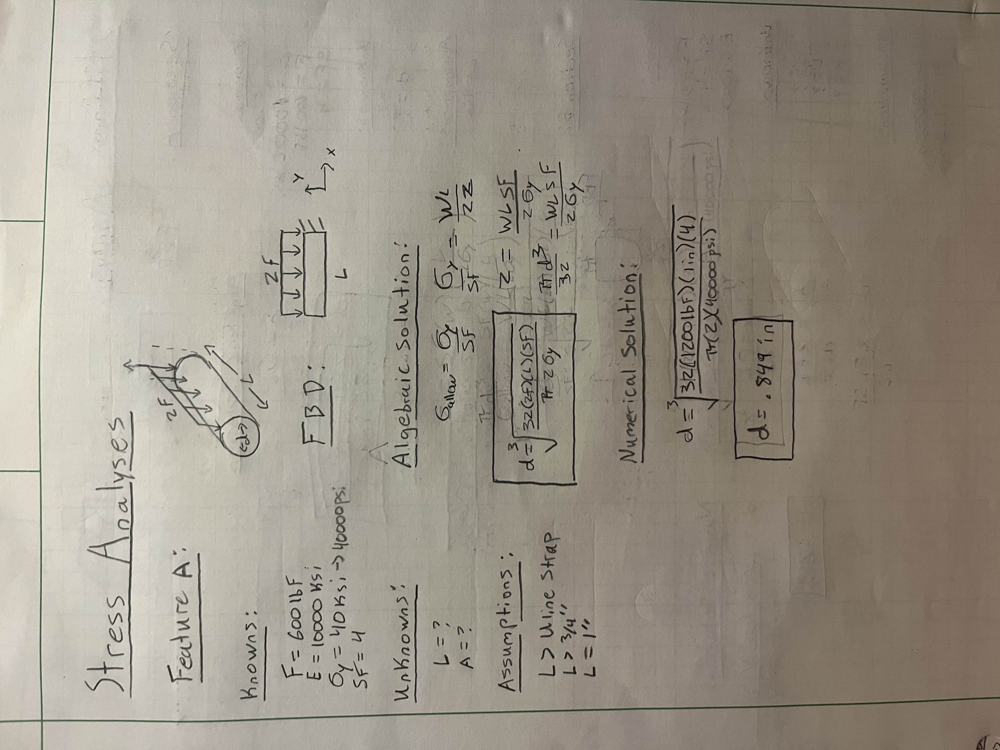
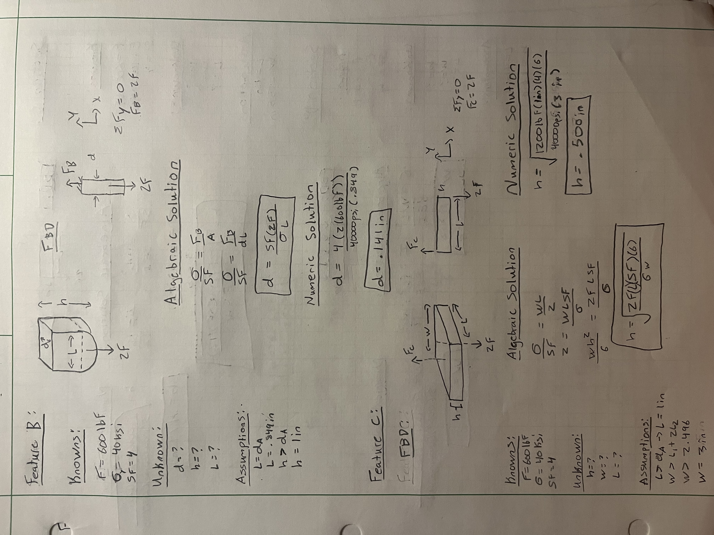
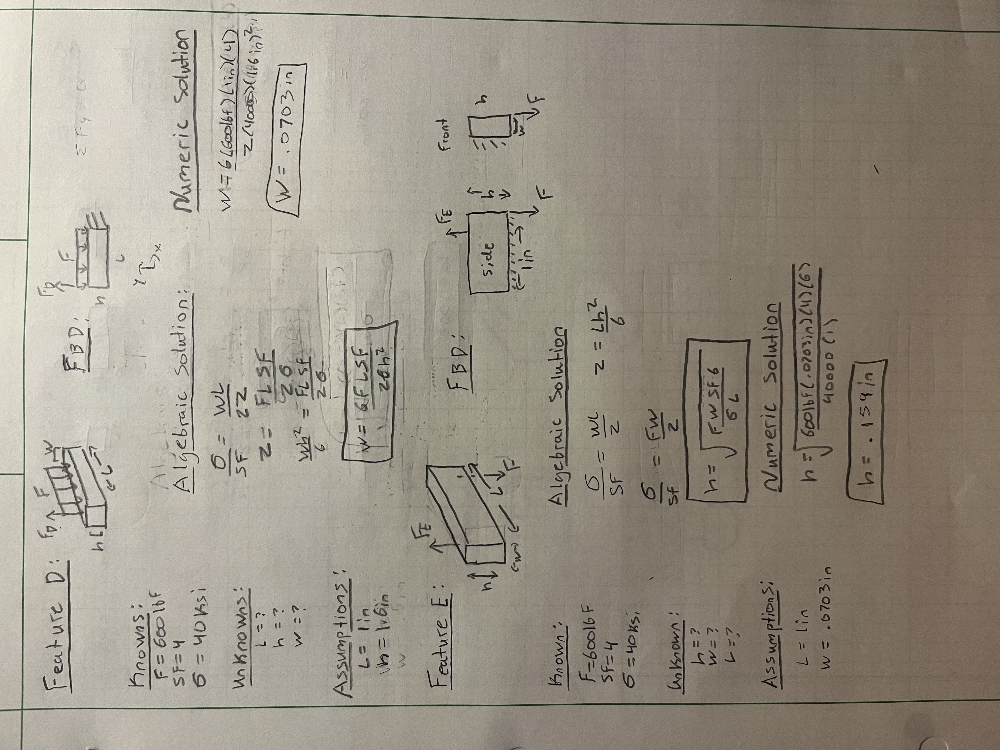
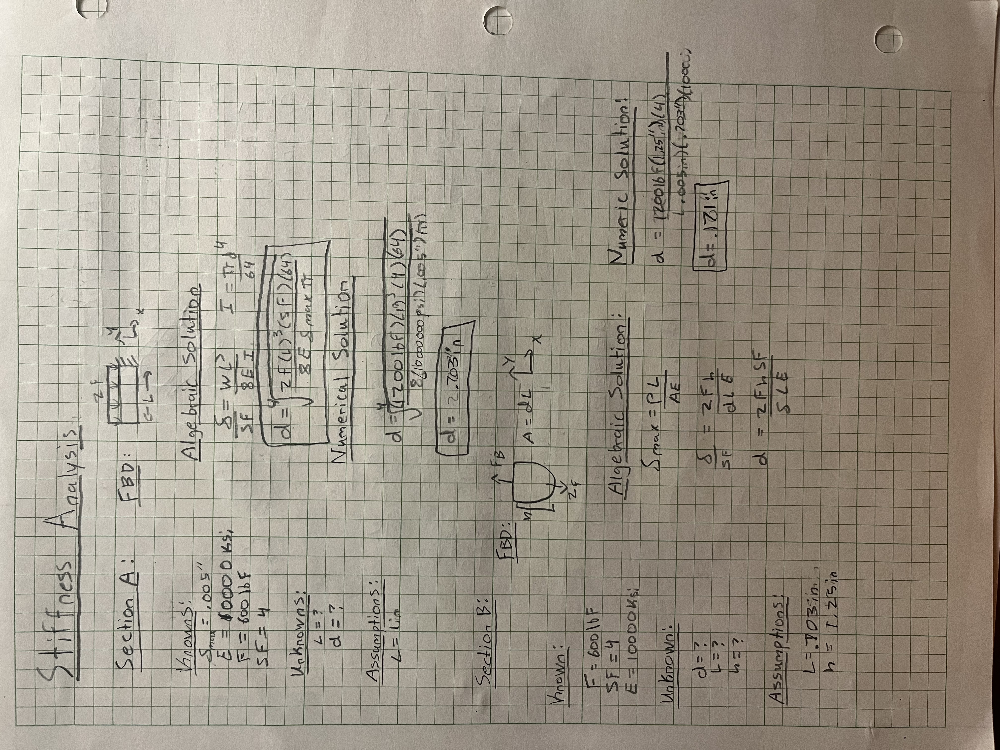
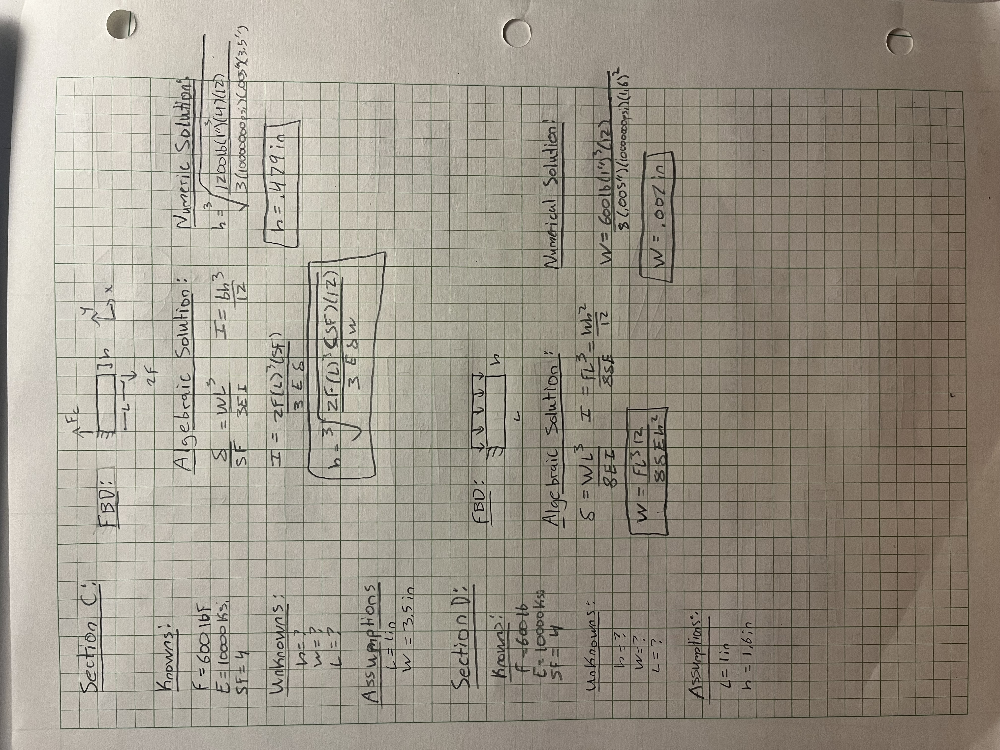
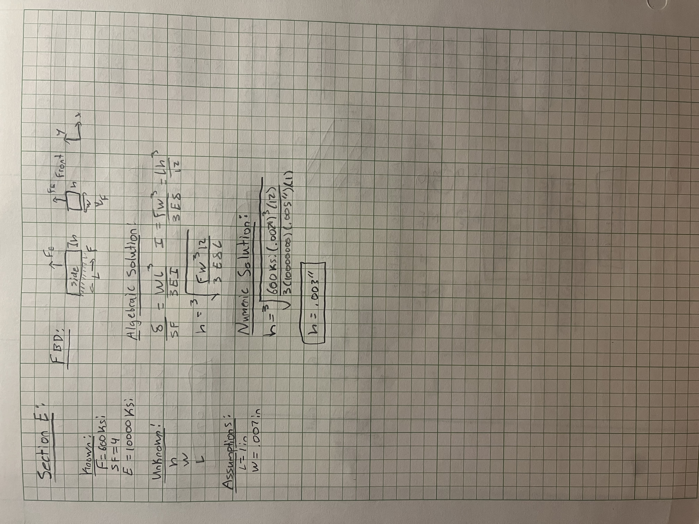
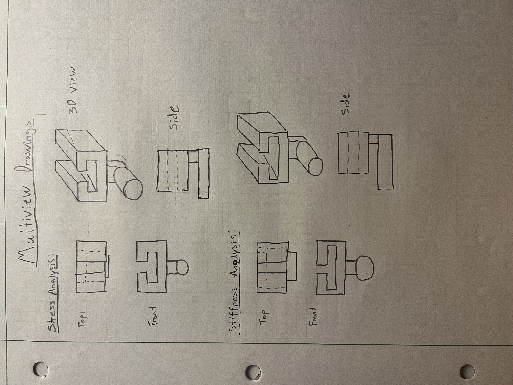

# A5 – [Bracket Design]

## Objective
- Conduct stress analysis to determine appropriate dimensions for structural features.
- Generate free body diagrams (FBDs) to visualize forces and constraints for each feature.
- Identify and document known and unknown variables, assumptions, and algebraic models for stress calculations.
- Perform stiffness analysis to establish minimum required dimensions based on deflection constraints.
- Compare stress and stiffness analyses to ensure structural integrity and compliance with given constraints.
- Create detailed multiview sketches illustrating dimensions derived from both stress and stiffness analyses.
- Reflect on and document key engineering lessons learned throughout the process.

## Description
Design using a safety factor of 4 and applied load in between 500 lbf < F < 800 lbf. Choose one of three metals, aluminum 6061 T6, Steel (ASTM A36), or Titanium (Ti-6Al-V4). Furthermore, state assumptions and approximations about the design in order to use fundamental strength of materials analysis. For example, use the proper stress analysis and deflection analysis where appropriate. Assume no failure due to direct shear stress. 

 

## Bracket Design
To design a symmetrical bracket with a safety factor of four an applied load between 500lbf and 800lbf, I first needed to determine my material and force load. For this design I chose aluminum because it had a high yield strength and elasticity without compromising on cost of manufacturing. The force load I determined to be 600lbf because it is a good median between 500lbf and 800lbf. 

**- Step 1 (Stress Analysis):**
In order to determine the correct dimensions for each feature I had to solve for allowable stress and section moduli (z) for each feature. Doing so allowed me to algebraically derive the dimension equations for each feature. 

**- Step 3 (Stiffness Analysis):**
Once the dimensions for the stress analyses were solved, I used stiffness analyses to find alternative dimensions for the bracket. This process required a deflection of (.005") factored into each feature. To solve for these dimensions, I used maximum deflection and inertia equations for each feature. Similar to the stress analyses, this allowed me to algebraically derive and solve for the appropriate dimensions. 

**- Step 4 (Multiview Sketches):** 
The stress and stiffness designs do contrast drastically in certain features. for example, feature d for the stiffness analysis is nearly .100" thinner than the stress analysis version. However, these sketches do not represent a super accurate representation of the actual dimensions of these designs due to human error and estimating the size when sketching. 

## Lessons Learned
This project took me about 5-6 hours to complete. I learned that aluminum has a very high elasticity which can make for some interesting dimensions if not calculated correctly. A lesson learned was to be careful when making assumptions on unknown dimensions. I do believe that some of my assumptions may have been wrong along with using a material with such high elasticity may have resulted in some incorrect dimensions when solving stiffness analyses, unfortunately I was way too deep to trace my steps back and correct these possible errors. 

