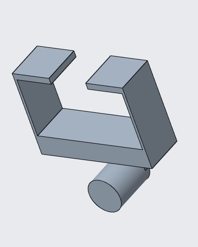
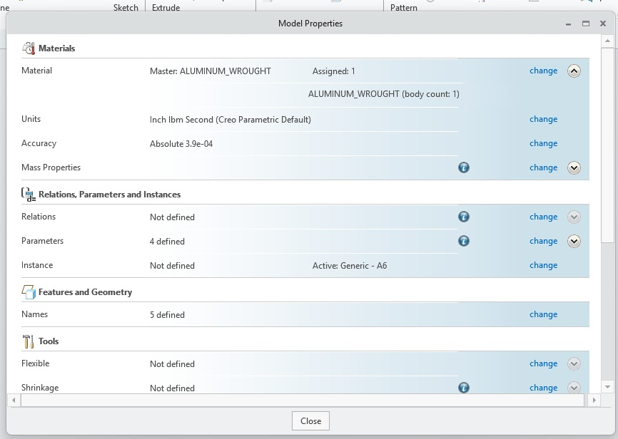
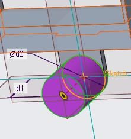
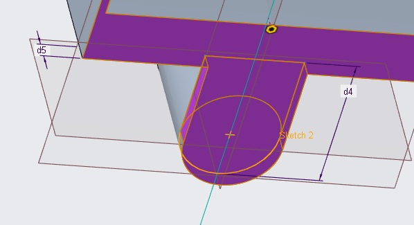
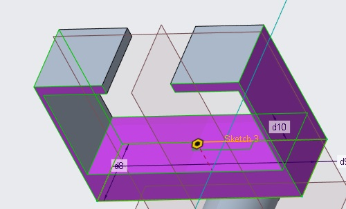
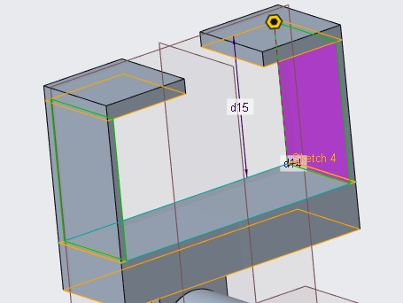
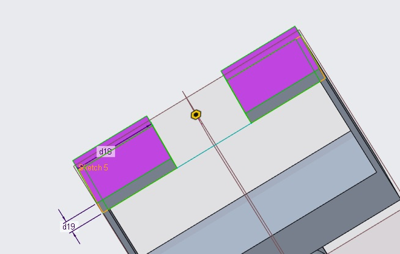
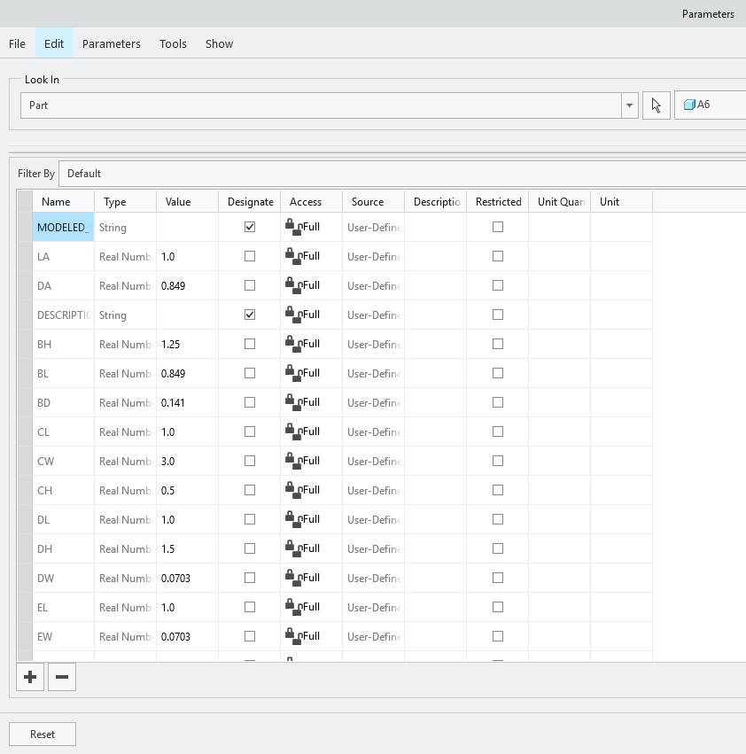
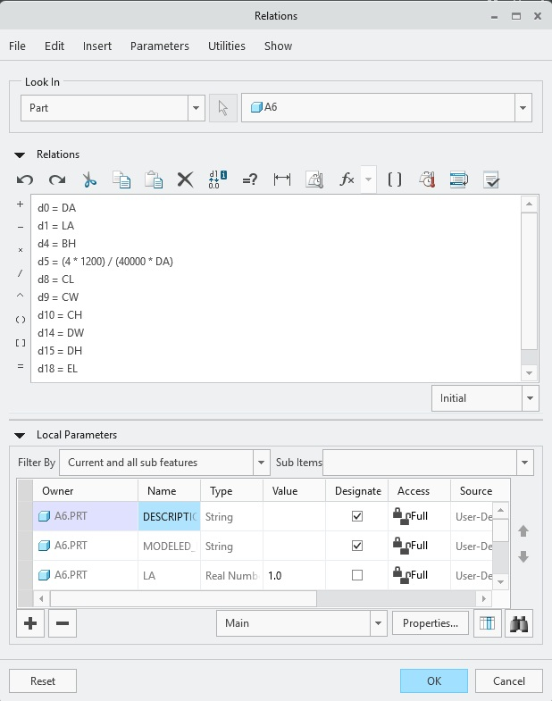
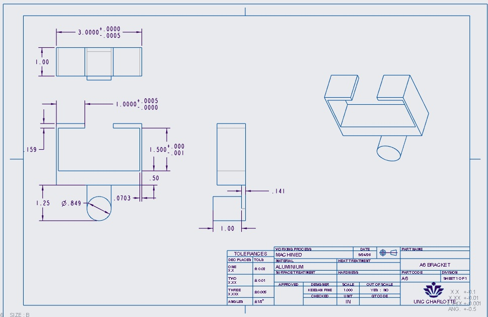

# A6 – [Bracket Design for Strength and Stiffness II]

## Objective
As part of this assignment, we will need to generate a comprehensive solid model and a multi-view engineering drawing that accurately represents the designed bracket from project A5, incorporating all features to ensure both strength and stiffness requirements are met. For reference we are still using Aluminum with a safety factor of 4 and an applied load of 600lbf. 

## Design

### Step 1: Strength vs Stiffness 

Before any drawings were made the first step in the modeling process was to specify which analysis design was going to be used. I chose the strength analysis design because it offered more robust dimensions without compromising strength. Unlike the stiffness analysis this design offered an overall thicker design particularly in features B and D. Once this was confirmed I opened the Creo software and proceeded to apply aluminum as the material and in/lbF as the units. 

 

### Step 2: Parametric Modeling 

Using Creo I created one solid part by creating continuous sketches starting from feature A and finishing at feature E. This strategy allowed me to get an idea of what the desired dimensions would look like. This strategy pointed out a few incorrect assumptions and dimensions I had used for my design. The original height for feature B was set to 1" but was changed to 1.25" to allow for slightly more clearance between features without negatively affecting the design. Feature D also had assumed height of 1.6" but was changed to 1.5" because I had mistakenly over made an over assumption in my previous A5 design. Afterwards I implemented all the desired dimensions into Creo Parameters and created relations to apply to my design. Below I have attached a series of pictures representing the order of operations. 

### Step 3: Tolerances and Drawing

In order to make sure this part was designed to specific tolerances I went back and added correct tolerances and sig figs to each of the features. Having all the correct dimensions and tolerances, I created a B size drawing with the UNCC provided format. When creating a drawing in Creo, the program can be picky about tolerance displays, so I had to go into the configuration settings and manually enable it. The drawing I created provides a 3D orthogonal view as well was a top, front, and right-side view of the part with dimensions, tolerances and hidden extrusions displayed. 

## Reflection 

I spent a total of 4 hours on this assignment. A lesson I learned was going back over my previous calculations and dimensions to make sure there were no miscalculations or changes that needed to be made before modeling the bracket in Creo. I used the strength equation to drive the diameter for feature A. To do this I used the allowable stress equation and the section moduli equation and equaled them out to solve for the diameter. this dimension controlled the width for feature B. The same allowable stress equation was used to solve for the thickness of feature B; this equation was plugged directly into Creo relations as d5 = (4*1200)/(40000*DA) and didn't change any dimensions from the original hand drawn design. The height for feature D has a loose fit tolerance of -.001" tolerance, this is a functional tolerance with a sliding fit interface. Th reason for this is because it allows the bracket to slide freely on the piece its mating to while still allowing for a snug fit. If I were to put unnecessarily tight tolerances across the whole design the manufacturing cost would significantly rise because of the precision it takes to make complex high tolerance parts. In order to make a part with a tolerance of .0001 vs .001 the manufacturing slows way down because the machinist would have to remove much smaller amounts of metal at a time in order to make sure the part doesn't go over that tolerance spec, where as a tolerance of .001 allows the machinist a lot more room for error. 

## CAD Files 
[Download CAD Files (.zip)](./a6.prt.zip)

